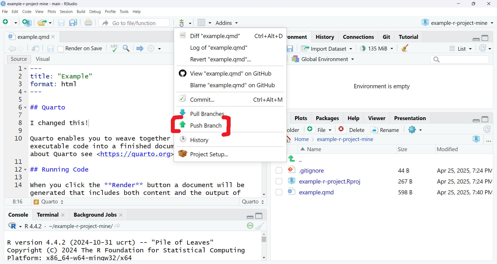

# Existing Repository

Someone has created a repository on GitHub for your team to use. Let's see some
options for editing it.

## Setup

### Download project

Open a new project from `Version Control`, and use the repository's URL.
`Project directory name` will be the folder name the directory is saved under,
and you're free to change where it is saved
(`Create project as subdirectory of`).


### Enter account details

You should optionally set up a name and email for your edits. Otherwise, R will
fill them with the placeholders `a` and `a`. Open the terminal and use

```text
git config --local user.name <preferred name>
git config --local user.email <preferred email>
```


## User Scenarios

Now, we'll cover some common scenarios that you'll encounter by collaborating
with Git.

### Saving Your Changes

You should already know how to save your changes to your computer in RStudio.
But you will also need to know how to save your changes to your local Git
repository. "Committing" these changes to Git will let you do other operations
like uploading your changes from local to Github or downloading others' changes
from GitHub to local.

Make your changes and checkbox whichever whichever changes you want commit, with
a description of your changes. Rstudio will highlight any additions or deletions
you've made in green or red.

 
 

### Downloading Changes

Your collaborators will be making changes to the repo. If you have not changed
anything since they uploaded changes, this is simple. If you have, Git may be
smart enough to merge some changes automatically. Otherwise, you might have to
merge.

```{note}
Git can automatically merge changes if they happen in different locations. See: TODO
```

TODO

### Uploading Changes

```{tip}
You can make multiple commits before pushing if you want more descriptive
commit messages.

Instead of "update," you can have a commit history of "update comments," "bugfix
graph," "clean up graph."
```

To upload, or "push," changes to the repo, make sure you have committed changes,
resolving any merge conflicts if they arise, and push them.


