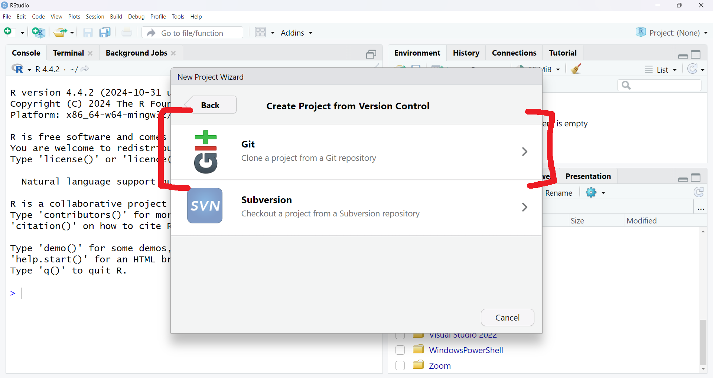
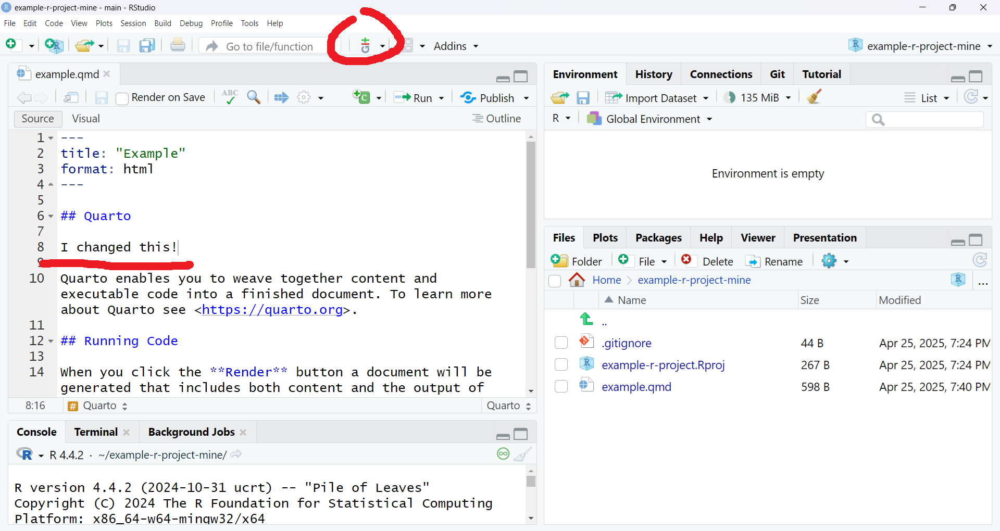

# Existing Repository

This page is useful if somebody has created a repository on GitHub for your team
to use. Let's see some options for editing it.

## Setup

### Download project

Create a new project from `Version Control`, and use the repository's URL.
`Project directory name` will be the folder name the directory is saved under,
and you're free to change where it is saved
(`Create project as subdirectory of`).





### Enter account details

You should optionally set up a name and email for your edits. Otherwise, R will
fill them with the placeholders `a` and `a`. Open the terminal and use

```text
git config --local user.name <preferred name>
git config --local user.email <preferred email>
```


## User Scenarios

Now, we'll cover some common scenarios that you'll encounter by collaborating
with Git.

### Saving Changes ("Committing")

You should already know how to save your changes to your computer in RStudio.
But you will also need to know how to save your changes to your local Git
repository. "Committing" these changes to Git will let you do other operations,
like uploading those commits from local to Github or downloading others' commits
from GitHub to local.

Make your changes and checkbox whichever whichever changes you want commit, with
a description of your changes. Rstudio will highlight any additions or deletions
you've made in green or red. Then, you can press `Commit`.

 
 

### Downloading Changes ("Pulling")

Your collaborators will be committing changes to the repo. Git may be smart
enough to merge some changes automatically but, you might have to manually
merge.

```{note}
Git can automatically merge changes if they happen in different locations in
the code.
```

Your first step to download changes will simply be to "pull" them from the
repository.


#### Automatic Merge

Pulling may merge automatically. For example, the following image says a
"Fast-forward" merge occurred. This happens when you track a repository, and you
have committed no local changes, so you simply update to a newer revision.


#### Manual Merge

You might pull changes that cannot be merged automatically. The following image
says a "Merge conflict" occurred.


Now, your code will have sections similar to the following, to signify areas of
conflict.

```
## Quarto

<<<<<< HEAD
I changed something different!
=======
I changed this!
>>>>>> f24284d87364d8fea9e2e02f2649f86f36567529

Quarto enables you to weave together content ...
```

You can simply change the sections to resemble normal code again. Do anything
you'd like: keep only your changes, keep your colleague's changes, mix and
match, or replace the code with a link to Never Gonna Give You Up. All Git is
waiting for is for the bracket symbols to be gone.

Here are some examples:

```
## Quarto

I changed this!

Quarto enables you to weave together content ...
```

```
## Quarto

I changed something different!

Quarto enables you to weave together content ...
```

```
## Quarto

We changed some stuff!

Quarto enables you to weave together content ...
```

```text
## Quarto

https://youtu.be/dQw4w9WgXcQ

Quarto enables you to weave together content ...
```

### Uploading Changes ("Pushing")

```{tip}
You can make multiple commits before pushing if you want more descriptive
commit messages.

Instead of telling your team you "updated lots of code," you can say you "updated
comments," "bugfixed graph," and "cleaned up graph."
```

To upload, or "push," changes to the repo:

1. make sure your changes are committed
1. pull
1. resolve any merge conflicts if they arise
1. push (shown below)


