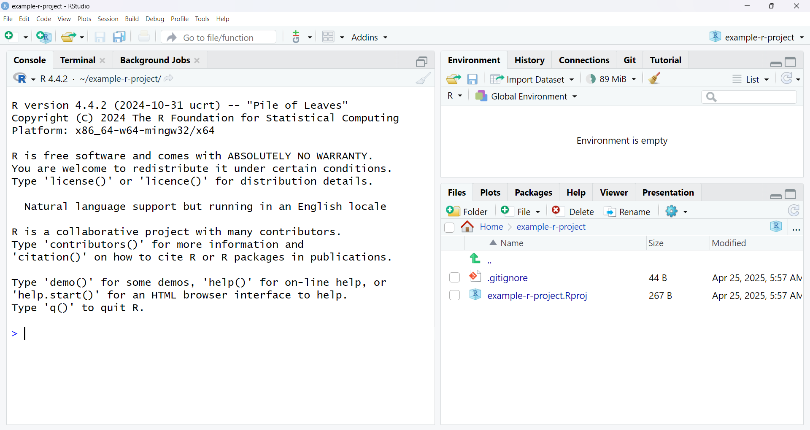

# Repository Setup

This page is useful if your team is starting from scratch, so you need a
repository on GitHub to work with.

```{hint}
Not the poor shmuck/happy nerd who has to do this part? Skip to the [next page](./existing-repository.md)!
```

## Create new repository on GitHub

Follow the prompts to create a new repository with your desired name. The other
options can be left as their defaults. (Unless you want a private repository.
Figuring that out is outside the scope of this tutorial, but it should be easy.)

````{tab} Show Images
```{figure-md}


Create a new repo
```

```{figure-md}


Name the repo
```

```{figure-md}


Success!
```
````

```{tab} Hide Images
...
```

## Create new local R Project

RStudio can create "projects," which will help your team keep code in one place.
Open RStudio and follow prompts to create, in a new directory, a new project
with a (local) git repository.

````{tab} Show Images
```{figure-md}


After clicking new project button in top left
```

```{figure-md}


After prompts
```

```{figure-md}


After prompts
```

```{figure-md}


Success!
```
````

```{tab} Hide Images
...
```

## WIP

Hmm. Turns out continuing is hard without the command line. Will investigate
further.
